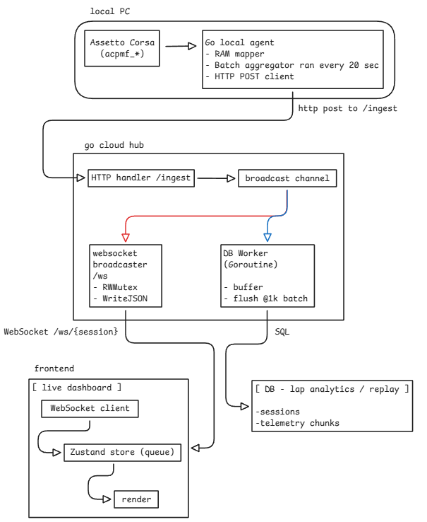

**Sequential**

---

<br/>

**1. Overview**

distributed, real-time telemetry pipeline for high-frequency Assetto Corsa data capture and visualization.

| Metric             | Value      | Notes                                    |
| ------------------ | ---------- | ---------------------------------------- |
| Sampling rate      | 60 Hz      | 16ms interval                            |
| End-to-end latency | < 50ms     | AC RAM locaiton → frontend visualization |
| Network overhead   | ~5KB/333ms | dynamic frame batches                    |
| Database write     | 1K/month   | -                                        |
| Memory footprint   | < 20MB     | container runtime                        |

-   Direct memory mapping eliminates serialization overhead
-   Separation of live and persistence paths
-   Dynamic aggregation reduces network overhead
-   ARM64 optimization for cost-efficient cloud deployment

<br/>
<br/>

**2.1 Local agent**

| Component        | Technology            | Justification                          |
| ---------------- | --------------------- | -------------------------------------- |
| Runtime          | Go 1.21+              | static compilation, low-level syscalls |
| Memory interface | Windows API           | direct shared memory mapping           |
| Serialization    | `encoding/json`       | Native, zero-dependency                |
| Concurrency      | Goroutines + channels | Non-blocking async HTTP                |

_Key Dependencies:_

-   `golang.org/x/sys/windows` - Windows syscall wrappers
-   Standard library only

<br/>
<br/>

**2.2 Cloud**

| Component   | Technology                  | Justification                       |
| ----------- | --------------------------- | ----------------------------------- |
| WebSocket   | Gorilla WebSockets          | Industry standard                   |
| Routing     | Custom handlers             | Minimal abstraction for performance |
| Concurrency | Goroutines + `sync.RWMutex` | Reader-optimized locking            |
| Container   | Docker multi-stage build    | 18MB final image                    |
| Platform    | Oracle Linux 8 (ARM64)      | Free tier - 4 ARM cores, 24GB RAM   |

_Key Dependencies:_

-   `github.com/gorilla/websocket` v1.5.0

<br/>
<br/>

**2.3 Frontend**

| Component        | Technology               | Justification                        |
| ---------------- | ------------------------ | ------------------------------------ |
| Framework        | React 18 + TypeScript    | Type safety, component model         |
| Build Tool       | Vite 5                   | Hot module replacement, ESM-native   |
| State            | Zustand                  | Minimal re-renders, no provider hell |
| Rendering        | HTML5 Canvas API (maybe) | 60fps hardware acceleration          |
| Styling          | Tailwind@4 i think       | -                                    |
| WebSocket Client | Native WebSocket         | Browser-native, zero overhead        |

<br/>
<br/>

**3. Architecture**

3.1 Overview



<br/>
<br/>

3.2 Component responsibilities

Local agent: `go/cmd/client`

-   Memory Mapping: `Local\acpmf_physics` & `Local\acpmf_graphics` via Win32 API
-   Sampling: 60Hz ticker with packet deduplication
-   Batching: 20 frames before HTTP POST
-   Session Management: detects lap completion, flushes batch on lap change

Cloud: `go/cmd/cloud`

-   Ingestion: `/ingest` endpoint receives JSON batches
-   Routing: Extracts `session_id` from query params
-   Broadcasting: out to all WebSocket clients subscribed to that session
-   Persistence: Async buffering → batch DB writes (1000-frame chunks)

DB worker

-   Isolation: Runs in dedicated Goroutine, never blocks broadcast path
-   Buffering: Accumulates frames until threshold (1000) or session change
-   Bulk Insert: Single `INSERT` with JSONB array reduces DB load
-   Error Handling: Logs failures, does not crash on DB unavailability

<br/>
<br/>

**4. Data Flow Lifecycle**

_1: Extraction_

Location: Local PC <br/>
Duration: 16.6ms (60Hz)

```go
// pointer cast - zero-copy read
physicsData := (*types.SPageFilePhysics)(unsafe.Pointer(ptr))
data := *physicsData

// deduplication check
if data.PacketId == lastPacketId {
    continue
}
```

_Optimizations:_

-   No JSON serialization during sampling
-   Struct alignment must match AC C++ memory layout exactly
-   `unsafe.Pointer` cast is safe (OS-managed memory) so ignore the warning

<br/>
<br/>

_2: Batching_

Trigger: buffer reaches 20 frames (~333ms worth of data)

```go
batch = append(batch, data)

if len(batch) >= 20 {
    go sendToCloud(batch, currentLap)
    batch = nil
}
```

Network Savings:

-   Without batching: 60 requests/sec = 3,600 req/min
-   With batching: 3 requests/sec = 180 req/min

<br/>
<br/>

_3: Transport_

Protocol: HTTP/1.1 POST  
Payload Example:

```json
POST /ingest?session_id=RACE-SPA-2026&lap=5
Content-Type: application/json

[
  {
    "packetId": 10245,
    "gas": 1.0,
    "brake": 0.0,
    "fuel": 8.3,
    "gear": 5,
    "rpms": 8232,
    "steerAngle": -0.12,
    "speedKmh": 287.4
  },
  // ... 19 more frames
]
```

Error Handling:

-   5-second timeout prevents hanging
-   Failed requests are logged and dropped
-   Agent continues sampling regardless of network state

<br/>
<br/>

_4: Cloud_

```go
var batch []types.SPageFilePhysics
json.NewDecoder(r.Body).Decode(&batch)

payload := types.TelemetryPayload{
    SessionID: r.URL.Query().Get("session_id"),
    Lap:       parseLap(r.URL.Query().Get("lap")),
    Data:      batch,
}

hub.BroadcastPayload(payload)
```

Dual-Path Routing:

1. broadcast path:

    - Immediate `select` on broadcast channel
    - `RWMutex.RLock()` for concurrent reads
    - `WriteJSON()` to all connected WebSocket clients
    - Latency should be < 1ms

2. DB path:
    - Push to buffered `dbQueue` channel with capacity of 100
    - Worker goroutine aggregates into 1000-frame chunks
    - Bulk `INSERT` when threshold reached
    - Latency around 10-50ms

<br/>
<br/>

**5: Visualization**

```javascript
function renderLoop() {
    const frame = frameQueue.shift();
    if (!frame) {
        requestAnimationFrame(renderLoop);
        return;
    }

    ctx.clearRect(0, 0, width, height);
    drawRPMNeedle(frame.rpms);
    drawSpeedometer(frame.speedKmh);

    // 60hz
    requestAnimationFrame(renderLoop);
}
```

State Management:

```javascript
// Zustand storel minimal re-renders
const useStore = create((set) => ({
    frameQueue: [],
    addFrames: (frames) =>
        set((state) => ({
            frameQueue: [...state.frameQueue, ...frames],
        })),
}));
```

<br/>
<br/>

**5. API Specifications**

_5.1 Ingestion Endpoint_

Purpose: Receive telemetry batches from local agents

```http
POST /ingest?session_id={uuid}&lap={number}
Content-Type: application/json

[
  {
    "packetId": int32,
    "gas": float32,       // 0.0 - 1.0
    "brake": float32,     // 0.0 - 1.0
    "fuel": float32,      // Liters
    "gear": int32,        // -1=R, 0=N, 1-8=Forward
    "rpms": int32,
    "steerAngle": float32,  // Radians
    "speedKmh": float32
  }
]
```

_Responses:_

-   `200 OK` - Batch accepted
-   `400 Bad Request` - Malformed JSON
-   `405 Method Not Allowed` - Non-POST request

<br/>
<br/>

_5.2 WebSocket stream_

Purpose: Real-time telemetry broadcast to dashboards

```http
GET /ws/{session_id}
Upgrade: websocket
Connection: Upgrade
```

<br/>
<br/>

_Server → Client messages:_

```json
{
    "sessionID": "RACE-SPA-2026",
    "lap": 5,
    "data": [
        {
            /* same structure as ingest payload */
        }
    ]
}
```

<br/>
<br/>

**6. DB Schema** - not implemented yet because oracle is refusing to let me log in

_6.1 Tables_

```sql
-- session metadata
CREATE TABLE sessions (
    id SERIAL PRIMARY KEY,
    session_uuid VARCHAR(64) UNIQUE NOT NULL,
    driver_name VARCHAR(64),
    track VARCHAR(64),
    car VARCHAR(64),
    created_at TIMESTAMP DEFAULT NOW(),
    updated_at TIMESTAMP DEFAULT NOW()
);

-- telemetry chucks storage
CREATE TABLE telemetry_chunks (
    id SERIAL PRIMARY KEY,
    session_uuid VARCHAR(64) REFERENCES sessions(session_uuid) ON DELETE CASCADE,
    lap INT NOT NULL,
    chunk_start_packet INT NOT NULL,
    chunk_end_packet INT NOT NULL,
    frame_count INT NOT NULL,
    data JSONB NOT NULL,  -- array of SPageFilePhysics objects
    created_at TIMESTAMP DEFAULT NOW()
);

-- indexes
CREATE INDEX idx_telemetry_session ON telemetry_chunks(session_uuid);
CREATE INDEX idx_telemetry_lap ON telemetry_chunks(session_uuid, lap);
CREATE INDEX idx_sessions_uuid ON sessions(session_uuid);
```

<br/>
<br/>

_6.2 Sample query; lap replay_

```sql
SELECT
    lap,
    data
FROM telemetry_chunks
WHERE session_uuid = 'RACE-SPA-2026'
  AND lap = 5
ORDER BY chunk_start_packet ASC;
```

<br/>
<br/>

**7. Performance**

_7.1 Latency_

| Stage               | Typical   | Worst Case | Notes                 |
| ------------------- | --------- | ---------- | --------------------- |
| Memory Read         | < 0.1ms   | 0.5ms      | direct pointer access |
| Batch aggregation   | 0         | 0          | In-memory append      |
| HTTP POST           | 5-15ms    | 100ms      | LAN latency           |
| Cloud processing    | < 1ms     | 5ms        | Channel + JSON decode |
| WebSocket broadcast | < 1ms     | 10ms       | WriteJSON per client  |
| visualization       | 16.6ms    | 33ms       | Locked to rAF (60Hz)  |
| _TOTAL_             | _25-35ms_ | _150ms_    | -                     |

<br/>
<br/>

_7.2 Resource util_

Local:

-   CPU: < 1% (single core)
-   Memory: 5-10 MB
-   Network: ~150 KB/min upload

Cloud (per session):

-   CPU: < 5% (ARM core)
-   Memory: 15-25 MB
-   Network: ~150 KB/min inbound + (150 KB × N clients) outbound

DB:

-   Write Rate: 1-2 transactions/minute
-   Storage: ~50 MB per 60-minute session (compressed JSONB)

<br/>
<br/>

**8. Dev**

8.1 Cloud deployment

```bash
# build ARM64 image
docker buildx build --platform linux/arm64 -t sequential:latest .

# push to Oracle container registry
docker tag sequential:latest iad.ocir.io/namespace/sequential:latest
docker push iad.ocir.io/namespace/sequential:latest

# deploy to OCI Compute instance
ssh opc@instance-ip
docker pull iad.ocir.io/namespace/sequential:latest
docker run -d -p 5000:5000 --name sequential sequential:latest
```

8.2 DB Setup

```bash
docker run -d \
  --name postgres \
  -e POSTGRES_PASSWORD=yourpassword \
  -v pgdata:/var/lib/postgresql/data \
  -p 5432:5432 \
  postgres:15-alpine

# run migrations
flyway migrate -url=jdbc:postgresql://localhost:5432/telemetry
```

<br/>
<br/>

**10. Local dev**

10.1 run

run Assetto Corsa, get into a session THEN:

```bash
# T1
docker run -d -p 5432:5432 -e POSTGRES_PASSWORD=dev postgres:15-alpine

# T2
cd go
go run cmd/cloud/main.go

# T3
cd go
go run cmd/client/main.go

# T4
cd frontend
npm install
npm run dev
```
